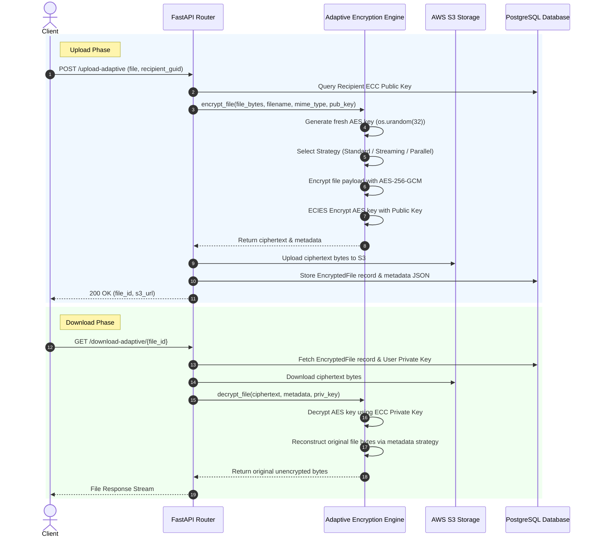

# CipherLink Adaptive Encryption Platform — Complete Guide & Operational Workflow

---

## 1. Overview & Architecture

**CipherLink** is an enterprise hybrid encryption platform designed for secure file uploads, downloads, and real-time messaging. It uses **ECIES (secp256k1)** for asymmetric key encapsulation and **AES-256-GCM** with an **Adaptive Strategy Design Pattern** for symmetric file encryption.

```
                     ┌──────────────────────────────────────────────────┐
                     │          CipherLink API / ExecutionContext       │
                     └─────────────────────────┬────────────────────────┘
                                               │
                                     Strategy Selection
                                               │
               ┌───────────────────────────────┼───────────────────────────────┐
               │                               │                               │
        File < 1 MB                     1 MB <= File <= 10 MB              File > 10 MB
               │                               │                               │
     ┌─────────▼─────────┐           ┌─────────▼─────────┐           ┌─────────▼─────────┐
     │ STANDARD Strategy │           │ STREAMING Strategy│           │ PARALLEL Strategy │
     │  Single-Pass GCM  │           │   64 KB Chunks    │           │4 MB Thread Pool GCM│
     └─────────┬─────────┘           └─────────┬─────────┘           └─────────┬─────────┘
               │                               │                               │
               └───────────────────────────────┼───────────────────────────────┘
                                               │
                                    Encrypted Payload Bytes
                                               │
                                 ┌─────────────▼─────────────┐
                                 │ AWS S3 / Encrypted Store  │
                                 └───────────────────────────┘
```

---

## 2. Encryption Workflow & Mechanics

### Strategy Selection Matrix

| Strategy | Trigger Condition | Mechanics | Security Guarantee |
| :--- | :--- | :--- | :--- |
| **`STANDARD`** | `< 1 MB` | Single-pass AES-256-GCM encryption over entire payload. | 96-bit nonce + 128-bit auth tag. |
| **`STREAMING`** | `1 MB to 10 MB` | Fixed **64 KB chunks** read sequentially. | **Independent fresh random 96-bit nonce & auth tag per chunk.** |
| **`PARALLEL`** | `> 10 MB` | Fixed **4 MB chunks** encrypted concurrently via `ThreadPoolExecutor`. | **Independent fresh random 96-bit nonce & auth tag per chunk.** |

> [!IMPORTANT]
> **No Key Reuse**: Every upload generates a **fresh 256-bit AES session key** via `os.urandom(32)`. The AES session key is encrypted **only once** using the recipient's ECC public key (`secp256k1`).

---

## 3. Step-by-Step Developer Guide

### A. How to Encrypt a File

```python
from src.websocket.adaptive_encryption import (
    encrypt_file,
    ExecutionContext,
    EncryptionPolicy,
    SystemProfile
)

# 1. Read file bytes
with open("report.pdf", "rb") as f:
    file_bytes = f.read()

recipient_public_key_hex = "02a1660042..." # 33-byte compressed hex ECC public key

# 2. Option A: Standard Call (Auto strategy selection)
result = encrypt_file(
    file_bytes=file_bytes,
    filename="report.pdf",
    mime_type="application/pdf",
    recipient_ecc_public_key_hex=recipient_public_key_hex
)

# 2. Option B: Advanced ExecutionContext Call
ctx = ExecutionContext(
    file_size=len(file_bytes),
    mime_type="application/pdf",
    policy=EncryptionPolicy.BALANCED,
    system_profile=SystemProfile.AUTO
)
result = encrypt_file(
    file_bytes=file_bytes,
    filename="report.pdf",
    mime_type="application/pdf",
    recipient_ecc_public_key_hex=recipient_public_key_hex,
    context=ctx
)

# Output structure
ciphertext_bytes = result["ciphertext"]
metadata_json = result["metadata"]
encrypted_aes_key_bytes = result["encrypted_aes_key_bytes"]
```

### Metadata JSON Schema

```json
{
  "version": "2.0",
  "encryption_strategy": "PARALLEL",
  "algorithm": "AES-256-GCM",
  "chunk_count": 3,
  "chunk_size": 4194304,
  "nonces": ["8f1a...", "9c2b...", "1d3e..."],
  "auth_tags": ["a1b2...", "c3d4...", "e5f6..."],
  "encrypted_aes_key": "04b9...",
  "filename": "report.pdf",
  "mime_type": "application/pdf"
}
```

---

### B. How to Decrypt a File

```python
from src.websocket.adaptive_encryption import decrypt_file

recipient_private_key_hex = "5f3a..." # 32-byte hex ECC private key

# Decrypt ciphertext using metadata and private key
decrypted_bytes = decrypt_file(
    ciphertext=ciphertext_bytes,
    metadata=metadata_json,
    recipient_ecc_private_key_hex=recipient_private_key_hex
)

# Save original file
with open("decrypted_report.pdf", "wb") as f:
    f.write(decrypted_bytes)
```

---

## 4. End-to-End Upload & Download Sequence



---

## 5. Testing & Verification

Run the test suite via PowerShell:

```powershell
# Run adaptive engine unit tests
.\env\Scripts\python.exe -m pytest tests/test_adaptive_encryption.py
```

Expected Output:
```
tests\test_adaptive_encryption.py ...... [100%]
6 passed in 1.73s
```
